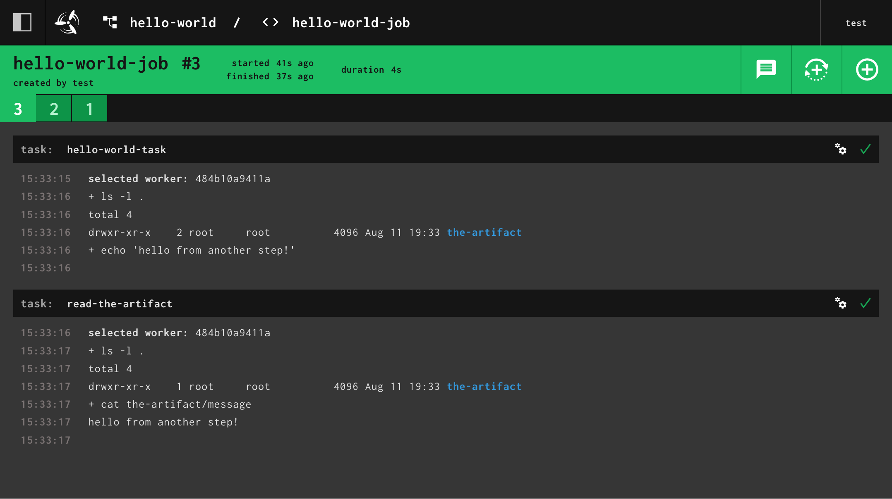

## Overview

This section is going to go over how to pass data between different [steps](https://concourse-ci.org/steps.html) in
a [job](https://concourse-ci.org/jobs.html). We'll continue building on our `hello-world.yml` pipeline.

In the previous section we learned that [steps](https://concourse-ci.org/steps.html) are where we tell Concourse what to
run (_i.e. run my tests, run this bash script, build this image, etc._). We are going to expand on the concept
of [steps](https://concourse-ci.org/steps.html) and show you how to pass artifacts/files
between [tasks](https://concourse-ci.org/tasks.html) using `inputs` and `outputs`.

## What are inputs and outputs

The simple answer is that inputs and outputs are directories that get passed between steps. We'll refer to both inputs
and outputs as **artifacts**.

Let's start exploring how artifacts work by adding
a [`task-config.outputs`](https://concourse-ci.org/tasks.html#schema.task-config.outputs) to our `hello-world-task`.

```yaml
jobs:
  - name: hello-world-job
    plan:
      - task: hello-world-task
        config:
          platform: linux
          image_resource:
            type: registry-image
            source:
              repository: busybox
              tag: latest
          # Adds a "the-artifact" directory to our task
          outputs:
            - name: the-artifact
          run:
            # Change the command to `ls -lF` to see
            # what the task sees in its working directory
            path: ls
            args: [ "-lF" ]
```

Update the pipeline and trigger the job:

```shell
$ fly -t tutorial set-pipeline -p hello-world -c hello-world.yml
$ fly -t tutorial trigger-job --job hello-world/hello-world-job --watch
...
selected worker: 57d7419112ca
running ls -lF
total 4
drwxr-xr-x    2 root     root          4096 Apr  8 16:42 the-artifact/
succeeded
```

We can see that in the task's [current working directory](https://en.wikipedia.org/wiki/Working_directory) there is now
a folder called `the-artifact`. Concourse makes output directories for you and will pass any contents inside the folder
onto later steps. Let's see how that works next.

## Passing outputs to another task

To pass artifacts from one task to another, the first task must declare an output. The second task must then declare an
input with the exact same name. Let's update the pipeline to do the following:

* Have the first task create a file inside `the-artifact`
* Create a second task to read the file inside `the-artifact` from the previous step

```yaml
jobs:
  - name: hello-world-job
    plan:
      - task: hello-world-task
        config:
          platform: linux
          image_resource: &image # Declaring a YAML anchor
            type: registry-image
            source:
              repository: busybox
              tag: latest
          outputs:
            - name: the-artifact
          run:
            # This is a neat way of embedding a script into a task
            path: sh
            args:
              - -cx
              - |
                ls -l .
                echo "hello from another step!" > the-artifact/message
      # Add a second task that reads the contents of the-artifact/message
      - task: read-the-artifact
        config:
          platform: linux
          image_resource: *image
          # To receive "the-artifact", specify it as an input
          inputs:
            - name: the-artifact
          run:
            path: sh
            args:
              - -cx
              - |
                ls -l .
                cat the-artifact/message
```

Update the pipeline and trigger the job:

```shell
$ fly -t tutorial set-pipeline -p hello-world -c hello-world.yml
$ fly -t tutorial trigger-job --job hello-world/hello-world-job --watch

initializing
selected worker: 57d7419112ca
running sh -cx ls -l .
echo "hello from another step!" > the-artifact/message

+ ls -l .
total 4
drwxr-xr-x    2 root     root          4096 Feb 26 19:09 the-artifact
+ echo 'hello from another step!'
initializing
selected worker: 57d7419112ca
running sh -cx ls -l .
cat the-artifact/message

+ ls -l .
total 4
drwxr-xr-x    1 root     root          4096 Feb 26 19:09 the-artifact
+ cat the-artifact/message
hello from another step!
succeeded
```

It's a bit hard to see when the first task stops and the second one starts in the terminal. Looking at the build from
the web UI makes this clearer:



With the above pipeline we can see that the file made in the first step is made available in the second step via
the `the-artifact`.

## How does Concourse track artifacts?

As Concourse is running the steps in your job, it is creating a list of **named artifacts**. Let's see what that looks
like for the pipeline we just ran.

* Concourse runs the task step `hello-world-task`
  with [output](https://concourse-ci.org/tasks.html#schema.task-config.outputs) `the-artifact`

!!! note ""

    Concourse creates an empty artifact, assigns it the name `the-artifact`, and mounts it inside the task container.

* Concourse runs the task step `read-the-artifact`
  with [input](https://concourse-ci.org/tasks.html#schema.task-config.inputs) `the-artifact`

!!! note ""

    Concourse looks up, in its list of artifacts for the build, for an artifact named `the-artifact`, and mounts 
    it inside the task container. If no input with that name is found then the build would fail.

The next section will introduce you to the concept of [Resources](https://concourse-ci.org/resources.html).

!!! note

    If you have any feedback for this tutorial please share it in 
    [this GitHub discussion](https://github.com/concourse/concourse/discussions/7353).