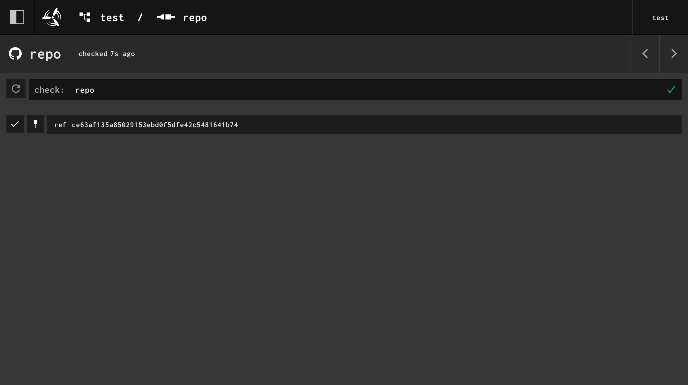
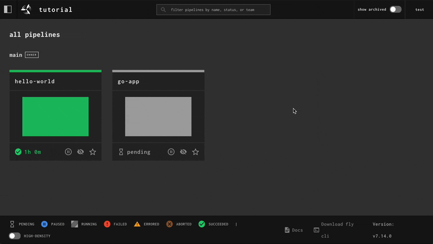
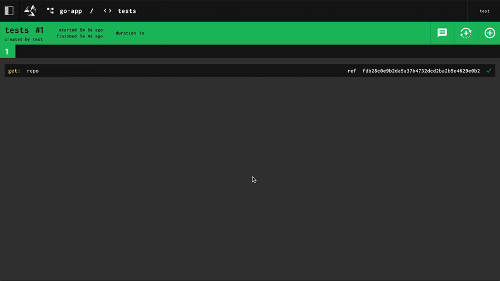
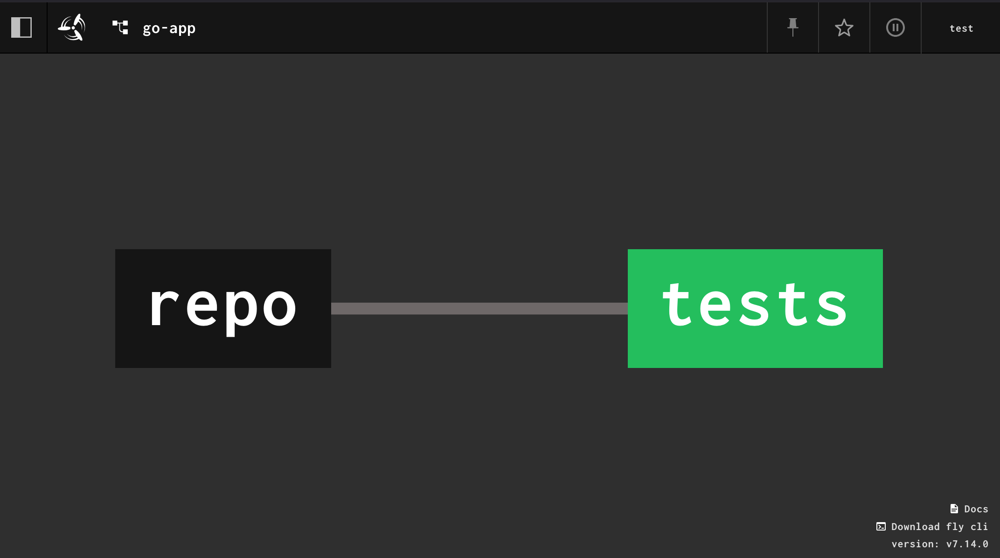
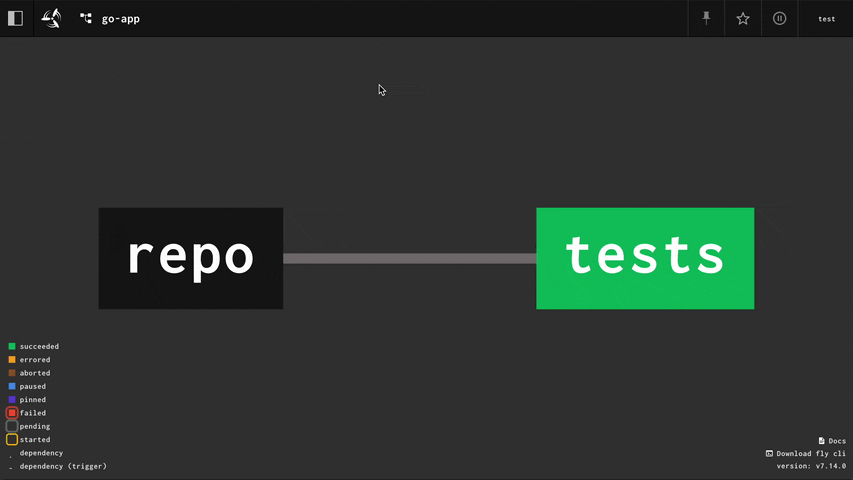
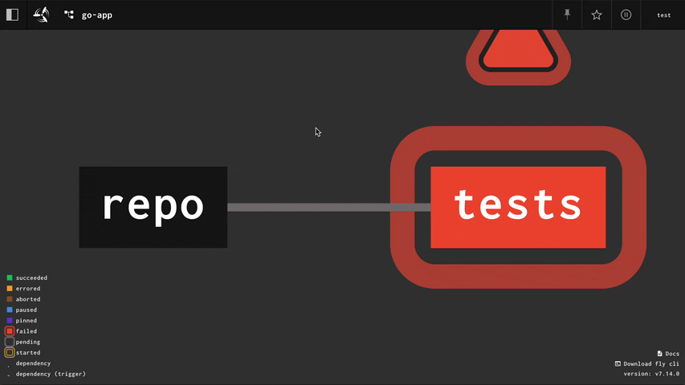

## The Heart of Concourse

Resources are the heart of Concourse. Resources make Concourse tick and are the source of automation within all
Concourse pipelines. Resources are how Concourse interacts with the outside world. Here's a short list of things that
resources can do:

* Run a job every five minutes: [Time resource](https://github.com/concourse/time-resource/).
* Run tests on new commits to the main branch: [Git resource](https://github.com/concourse/git-resource).
* Publish a new release of your app on
  Github: [GitHub Release resource](https://github.com/concourse/github-release-resource/).
* Pull or push the latest image of your
  app: [Registry-image resource](https://github.com/concourse/registry-image-resource/)

Resources can do a lot of things! The main goal of resources is to represent some external system or object in your
pipeline. That external thing can then be used as a trigger for your Jobs or your Jobs can push back and modify the
external system or object. It all depends on the resource you use and what features its author has implemented.

Resources are also how Concourse tries to stay as technology agnostic as possible. For example: Concourse doesn't care
what [version control system](https://en.wikipedia.org/wiki/Version_control) you store your code in, if you deploy apps
with [Helm](https://helm.sh/) or [Terraform](https://www.terraform.io/), or what language your apps are built in. If you
can put your latest and hottest tech behind the resource interface then Concourse can understand your workflow.

The Concourse team bundles a few basic resource types that come with the Linux release that you
can [download from GitHub](https://github.com/concourse/concourse/releases). You'll notice that the Linux tarball is
much larger than the macOS or Windows tarball because of all the bundled resources.

!!! note

    You can find out which resources a worker has by running:
    
    ```shell
    fly -t tutorial workers --details
    ```

Resources only run on Linux workers because resources are distributed as Linux container images. There are currently no
resources for macOS or Windows. Only [task steps](https://concourse-ci.org/task-step.html) can run on macOS or Windows
workers.

## Versions

Resources represent the external system or object to Concourse by
emitting [versions](https://concourse-ci.org/config-basics.html#schema.version). When a new version is emitted by a
resource, that is how Concourse knows to start jobs connected to the resource.

A version is a map of key-value strings that a resource generates to uniquely identify the state of the external system
or object.

For example, the git resource emits versions based on the SHA of new commits it finds. A single version from the git
resource will look like this to Concourse.

```json
{
  "ref": "ce63af135a85029153ebd0f5dfe42c5481641b74"
}
```

Which looks like this in the web UI:



Let's start digging into resources a bit more by going over the resource interface.

## Resource Interface

Resources are [container images](https://en.wikipedia.org/wiki/Open_Container_Initiative) that contain three
executables. Each executable is run by a different type of [step](https://concourse-ci.org/steps.html) within a
pipeline:

* `/opt/resource/check` - implicitly run when a [job](https://concourse-ci.org/jobs.html) contains
  a [get step](https://concourse-ci.org/get-step.html). Should return the latest version from the external system or
  object. Its responsibility is to find new versions. Is never part of a Job's build plan.
* `/opt/resource/in` - run in a [get step](https://concourse-ci.org/get-step.html). in is given a specific version (
  generated by a `check` or [`put` step](https://concourse-ci.org/put-step.html)) and retrieves the files and
  information representing that version from the external system or object.
* `/opt/resource/out` - run in a [put step](https://concourse-ci.org/put-step.html). Generates a new version, usually
  based on some input generated by another step in the job. Depending on the resource, this may mean sending something
  to the external system. For the git resource, this means pushing commits to the external git repository.

That's a high-level overview of the resource interface, which should help you understand what's going on with resources
when we start using them in the next section.

## Automatically Triggering Jobs With Get Steps

We're going to create a new pipeline now. This pipeline is going to:

* Fetch commits from a Git repository that contains an app
* Run some unit tests for that app
* Publish our app to GitHub

We have a very basic app in our [github.com/concourse/examples](https://github.com/concourse/examples) repo that we'll
use in your pipeline. You should fork this repository so you can continue following along. We're going to build the Go
app under the `apps/golang/` directory.

When creating a new [Job](https://concourse-ci.org/jobs.html) or [Pipeline](https://concourse-ci.org/pipelines.html), it
can be helpful to think of all the external things the job will need in order to run, and declare them
as [Resources](https://concourse-ci.org/resources.html) in our pipeline. We know we'll need our Git repository with our
app's code, so we'll declare that as a resource first.

We will use the [git resource](https://github.com/concourse/git-resource/) to represent our Git repository.
The `README.md` contains the documentation for how to use the resource.

```yaml
resources:
  - name: repo
    type: git
    source:
      uri: https://github.com/concourse/examples.git
      username: <user>
      password: github_pat_...
```

!!! note

    You'll need to generate a Personal Access Token for GitHub in order to complete this tutorial. You can make a
    fine-grained access token on [this page](https://github.com/settings/personal-access-tokens). The only permission
    required is `read-write` access to `content`. You may scope the token to your fork of the `examples` repository.

We've added a top-level key to our pipeline called [resources](https://concourse-ci.org/resources.html), which takes an
unordered list of resouces that can be referenced by jobs in our pipeline.

When declaring a resource, Concourse only requires you to declare
the [`name`](https://concourse-ci.org/resources.html#schema.resource.name)
and [`type`](https://concourse-ci.org/resources.html#schema.resource.type). The `name` is how jobs will reference the
resource.

Depending on the resource type you're using, the `source` will likely have one or more required fields. This is specific
to each resource type, so refer to the documentation of the resource type to find out what fields are required.

Next, we can add a job that references our resource. Let's add a job to our pipeline that, for now, downloads our git
repo. We'll use the [`get` step](https://concourse-ci.org/get-step.html) to do this.

```yaml
resources:
  - name: repo
    type: git
    source:
      uri: https://github.com/concourse/examples.git
      username: <user>
      password: github_pat_...

jobs:
  - name: tests
    plan:
      - get: repo
```

Let's set and run this pipeline.

```shell
fly -t tutorial set-pipeline --pipeline go-app --config pipeline.yml
fly -t tutorial unpause-pipeline --pipeline go-app
```

To change things up, let's trigger our `tests` job from the web UI. From the dashboard you can click on the pipeline
header to see the entire pipeline. You'll see two boxes, the left box representing our repo resource, and the right box
representing our `tests` job.

Clicking on the `tests` job will take you to the [Builds](https://concourse-ci.org/builds.html) page of the job. In the
top-right corner there will be a plus-sign button you can click to trigger the job. Click that button and wait for the
job to start and complete. You can click the [`get` step](https://concourse-ci.org/get-step.html) to expand it and see
the metadata fetched by the `git` resource.



```yaml
resources:
  - name: repo
    type: git
    source:
      uri: https://github.com/concourse/examples.git
      username: <user>
      password: github_pat_...

jobs:
  - name: tests
    plan:
      - get: repo
      - task: tests
        config:
          platform: linux
          image_resource:
            type: registry-image
            source: # Use the Golang image from Docker Hub
              repository: golang
              tag: latest
          inputs:
            - name: repo
          run:
            path: sh
            args:
              - -c
              - |
                cd repo/apps/golang
                go test -v .
```

There are a few things happening in this [`task` step](https://concourse-ci.org/task-step.html) we added.

First, we had to choose a container image to use to run our tests in. To run our Go tests we need an image with the `go`
binary. The [golang image from Docker Hub](https://hub.docker.com/_/golang) is an easy solution to reach for here, so we
tell Concourse to use that image to run this task. Concourse uses
the [registry-image resource](https://github.com/concourse/registry-image-resource) to download the Golang image.

Next, we needed to provide our task with a copy of our git repo. The `get: repo` step added an artifact named `repo`
that our task can reference as an [input](https://concourse-ci.org/tasks.html#schema.task-config.inputs). Concourse will
then take care of mounting a copy of our repo from the [`get` step](https://concourse-ci.org/get-step.html) into our
task's container.

The last part is us writing a small shell script that changes to the directory of our Go tests and finally
runs `go test -v .`. We added `-v` to get a little more output from the tests.

Let's update our pipeline and trigger the job from the web UI again.

```shell
fly -t tutorial set-pipeline --pipeline go-app --config pipeline.yml
```



Our tests run successfully! Let's update the job so it will run on every new commit instead of waiting for us to
manually start the job. We do this by adding `trigger: true` to the `get` step.

```yaml
resources:
  - name: repo
    type: git
    source:
      uri: https://github.com/concourse/examples.git
      username: <user>
      password: github_pat_...

jobs:
  - name: tests
    plan:
      - get: repo
        # Cause job to run on new commits
        trigger: true
      - task: tests
        config:
          platform: linux
          image_resource:
            type: registry-image
            source: # Use the Golang image from Docker Hub
              repository: golang
              tag: latest
          inputs:
            - name: repo
          run:
            path: sh
            args:
              - -c
              - |
                cd repo/apps/golang
                go test -v .
```

```shell
fly -t tutorial set-pipeline --pipeline go-app --config pipeline.yml
```

This change is also visually represented in the web view of the pipeline. The line connecting the resource to the job
changes from a dashed line:


To a solid line:



Let's test this out by making a commit. In the `examples` repo, open `apps/golang/main.go`. Let's break the tests by
changing the `AddSix()` function to add seven instead of six.

```go
func AddSix(i float64) float64 {
    return i + 7
}
```

Commit the change and then wait for the pipeline to pick it up and run the `tests` job. You can click on the resource to
see when Concourse finds the commit. You can then back out to the overview of the pipeline and see the job start on its
own.



!!! note

    By default, Concourse runs the `check` script of a resource every ~1 minute. You can click on the resource to see when
    it was last checked. You can also press the refresh button to force a check to run.

Let's fix the tests by undoing our change.

```go
func AddSix(i float64) float64 {
    return i + 6
}
```



In the next section we'll add a job to publish our app as a release on GitHub.

## Publishing with Put Steps